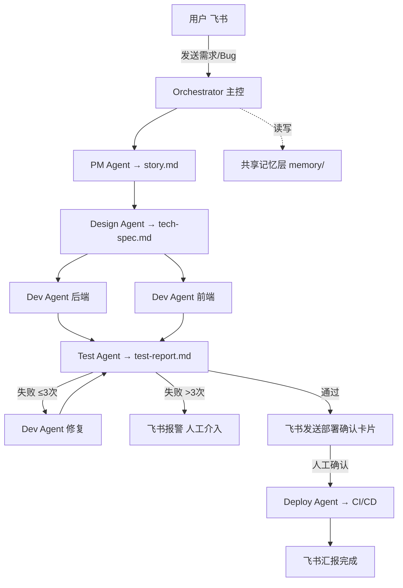

# 多 Agent 协作自动化软件开发系统

通过飞书接收需求/Bug，由多个 AI Agent 协作完成从「需求理解 → 设计 → 开发 → 测试 → 部署」的完整软件开发链路。

## 架构图



## 快速开始

### 1. 前置条件

- Node.js 18+
- 已安装并登录 Claude Code：`claude login`
- 已创建飞书机器人（开放平台 → 机器人 → 订阅 im.message.receive_v1 事件）

### 2. 安装依赖

```bash
npm install
```

### 3. 配置

复制配置模板并填写：

```bash
cp config.toml.example config.toml
```

编辑 `config.toml`，必填项：

| 字段 | 说明 |
|------|------|
| `feishu.app_id` | 飞书机器人 App ID |
| `feishu.app_secret` | 飞书机器人 App Secret |
| `feishu.verification_token` | 飞书事件验证 Token（推荐填写） |
| `project.workspace_path` | 目标代码仓库的**绝对路径** |
| `project.test_command` | 运行测试的命令，如 `make test` |
| `project.deploy_command` | 部署命令，如 `git push origin main` |

意图分类（可选，不填时自动降级为关键词匹配）：

```bash
# 方式一：环境变量
export BLACKBOX_API_KEY="your-key"

# 方式二：config.toml [blackbox] 段
```

Memory API（可选，不填时无历史记忆，但流水线正常运行）：

本系统调用 `http://localhost:8000` 作为记忆存储后端，未启动时自动降级为空上下文，不影响主流程。

### 4. 初始化记忆库

编辑 `memory/facts.md`，填写目标项目的技术栈、模块结构等信息，供所有 Agent 读取：

```markdown
## 技术栈
- 后端: Go + Gin
- 前端: Next.js + TypeScript
- 数据库: PostgreSQL
...
```

### 5. 启动

```bash
npm start
```

开发模式（文件变更自动重启）：

```bash
npm run dev
```

### 6. 飞书配置

在飞书开放平台配置 Webhook：

```
事件回调 URL: http://your-server:8765/
```

确保飞书机器人订阅了以下事件：
- `im.message.receive_v1`（接收消息）
- `card.action.trigger`（卡片按钮点击，用于部署确认）

## 飞书使用方式

在飞书群中 @机器人 发送：

| 命令/消息 | 作用 |
|-----------|------|
| `修复用户搜索接口返回重复数据的bug` | 启动 Bug 修复流水线 |
| `新增用户头像上传功能` | 启动新需求流水线 |
| `/status` | 查询进行中的任务列表 |
| `/deploy <task_id>` | 确认部署（也可点击卡片按钮） |
| `/cancel <task_id> [原因]` | 取消/终止任务 |

## 工作流程

```
飞书消息
    │
    ▼
[INTAKE] 意图分类（feature / bug / query / invalid）
    │
    ▼
[PLANNING] PM Agent → work/<task_id>/story.md
    │
    ▼
[DESIGN] Design Agent → work/<task_id>/tech-spec.md
    │
    ▼
[DEVELOPMENT] Dev Agent 前后端并行
    ├── 后端 → work/<task_id>/dev-report-backend.md
    └── 前端 → work/<task_id>/dev-report-frontend.md
    │
    ▼
[TESTING] Test Agent（最多重试 max_test_retries 次）
    │
    ├──失败×N──→ Dev Agent 修复 → 重新测试
    ├──失败超限──→ 飞书报警，等待人工介入
    │
    ▼ 通过
[DEPLOY_CONFIRM] 飞书发送交互卡片 ← 人工节点
    │ 点击"确认部署"
    ▼
[DEPLOYING] Deploy Agent → 执行 deploy_command
    │
    ▼
[DONE] 飞书汇报 + 写入记忆
```

## 项目结构

```
multi-agent-system/
├── src/
│   ├── main.ts              # 主入口
│   ├── config.ts            # 配置加载（config.toml）
│   ├── orchestrator.ts      # 主编排器（流水线控制）
│   ├── feishu_bot.ts        # 飞书 HTTP 推送集成
│   ├── state_machine.ts     # 工作流状态机（JSON持久化）
│   ├── memory_client.ts     # Memory API HTTP 客户端
│   └── agents/
│       ├── base_agent.ts    # runAgent() 封装 + 工具函数
│       ├── pm_agent.ts      # PM Agent（需求分析）
│       ├── design_agent.ts  # Design Agent（技术方案）
│       ├── dev_agent.ts     # Dev Agent（前后端并行编码）
│       ├── test_agent.ts    # Test Agent（测试验证）
│       └── deploy_agent.ts  # Deploy Agent（部署执行）
├── .claude/agents/          # Agent 系统提示文件
│   ├── pm.md
│   ├── design.md
│   ├── dev_backend.md
│   ├── dev_frontend.md
│   ├── test.md
│   └── deploy.md
├── memory/                  # 共享记忆目录
│   ├── facts.md             # 项目长期事实（需手动初始化）
│   ├── decisions/           # 架构决策记录
│   ├── patterns/            # 代码模式库
│   ├── bugs/                # 已知 Bug 库
│   └── daily/               # 每日任务日志
├── states/                  # 任务状态（JSON持久化，自动生成）
├── logs/                    # 日志文件（自动生成）
├── config.toml              # 配置（从 config.toml.example 复制）
├── config.toml.example      # 配置模板
├── package.json
└── tsconfig.json
```

注意：Agent 的工作文件（story.md、tech-spec.md 等）生成在目标项目的 `work/<task_id>/` 目录下，而非本项目。

## 扩展

- **新增 Agent**：在 `src/agents/` 添加新文件，在 `.claude/agents/` 添加系统提示，在 `orchestrator.ts` 接入流水线
- **修改记忆策略**：调整 `memory_client.ts` 的检索参数（limit、threshold）
- **替换意图分类**：修改 `orchestrator.ts` 的 `classifyByBlackbox()` 或直接用 Claude API
- **调整重试次数**：修改 `config.toml` 的 `max_test_retries`
